# CryptoVigilante 🚀
Sistema de integración y monitoreo de precios de Bitcoin.

## 📋 Descripción
Este proyecto implementa una arquitectura de microservicios para monitoreo financiero. 
1. **Worker ETL:** Un script en segundo plano consulta la API de CoinGecko y persiste los datos en una base de datos SQL.
2. **API REST:** Una interfaz construida con FastAPI que expone los datos almacenados para su consumo por clientes externos.

```mermaid
graph LR
    subgraph Internet Exterior
        A[☁️ CoinGecko API]
    end

    subgraph CryptoVigilante System
        B(🐍 monitor.py - Worker)
        C[(🗄️ base_datos_crypto.db - SQLite)]
        D(🚀 api.py - FastAPI)
    end

    subgraph Consumidores
        E[👤 Cliente / Navegador / App]
    end

    %% Flujo de Datos
    A -- "1. GET (Extract)" --> B
    B -- "2. INSERT (Load)" --> C
    E -- "3. GET /ultimo" --> D
    D -- "4. SELECT (Query)" --> C
    C -.-> D
    D -- "5. JSON Response" --> E

    style A fill:#f9f,stroke:#333,stroke-width:2px
    style C fill:#ff9,stroke:#333,stroke-width:2px
    style E fill:#9ff,stroke:#333,stroke-width:2px
```



## 🛠 Tecnologías
- **Lenguaje:** Python 3.10+
- **Base de Datos:** SQLite (SQL)
- **API:** FastAPI, Uvicorn
- **Cliente HTTP:** Requests

## ⚙️ Instalación y Uso

1. Clonar el repositorio.
2. Crear entorno virtual: `python -m venv venv`
3. Instalar dependencias:
   ```bash
   pip install requests fastapi uvicorn

